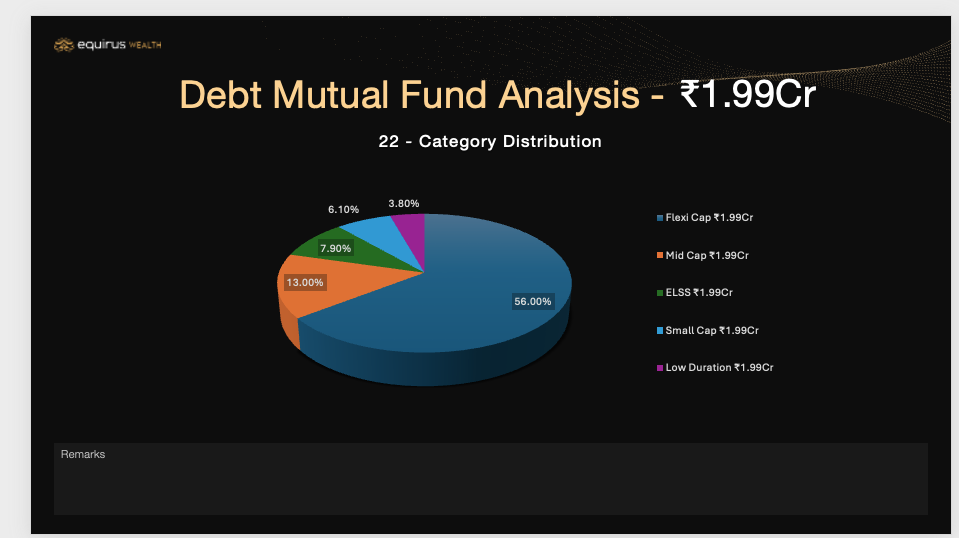
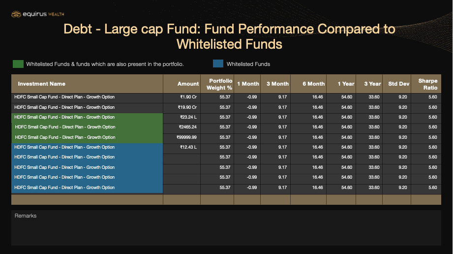

# PowerPoint Generator

### Problem Statement
As a Relationship Manager, you often need to provide clients with monthly summaries of their investments or prepare presentations for pitches. It's crucial to have a solution that can quickly generate PowerPoint presentations with accurate data sourced from CAS or other vendors. These presentations should include well-designed charts and precise numbers to effectively convey information to clients.

## Usage:
Provide Json Input to Our Method
```kotlin
fun generatePPT() {
    val pptParametersJson = IOUtils.toString(ClassPathResource("ppt_template/pptTemplate.json").inputStream, StandardCharsets.UTF_8)
    val outputFile = PPTGenerator.generatePPT(
      outputFileName = "john_doe_prospect",
      pptParameters = JsonUtil.objectMapper.readValue(pptParametersJson, object : TypeReference<List<PowerPointParameter>>() {}),
      templateFileInputStream = this.javaClass.classLoader.getResourceAsStream("ppt_template/pptTemplate.pptx")!!
    )
    Assertions.assertThat(outputFile.lengthInMb()).isGreaterThan(7.5)
  }
```


* Example 1
```json
{
  "slideIndex": 21,
  "contentsMetaData": [
    {
      "info": "Category Distribution Title",
      "type": "TEXT",
      "content": "₹1.99Cr",
      "fontSize": 40,
      "textPreferredColor": "WHITE",
      "coordinate": {
        "leftUpperX": 670.93,
        "leftUpperY": 54.14,
        "width": 170.35,
        "height": 55.84
      }
    }
  ],
  "chartsMetadata": [
    {
      "shapeId": 3,
      "chartIndex": 19,
      "chartName": "Category Distribution",
      "categorizedData": [
        {
          "name": "Flexi Cap ₹1.99Cr",
          "values": [55.99]
        },
        {
          "name": "Mid Cap ₹1.99Cr",
          "values": [12.99]
        },
        {
          "name": "ELSS ₹1.99Cr",
          "values": [7.87]
        },
        {
          "name": "Small Cap ₹1.99Cr",
          "values": [6.12]
        },
        {
          "name": "Low Duration ₹1.99Cr",
          "values": [3.78]
        }
      ]
    }
  ]
}
```
Output 
**_Category Distribution Slide_** 

* Example 2
```json
{
    "slideIndex": 29,
    "contentsMetaData": [
      {
        "info": "Underlying Debt MF Holdings Title",
        "type": "TEXT",
        "textHexColor": "#F8D39A",
        "content": "Debt - Large cap Fund: Fund Performance Compared to Whitelisted Funds",
        "fontSize": 28,
        "inputTextAlignment": "CENTER",
        "textPreferredColor": "WHITE",
        "coordinate": {
          "leftUpperX": 66.04,
          "leftUpperY": 39.97,
          "width": 841.85,
          "height": 53.86
        }
      },


      {
        "info": "Fund Name 1",
        "type": "TEXT",
        "content": "HDFC Small Cap Fund - Direct Plan - Growth Option",
        "fontSize": 9.0,
        "textPreferredColor": "WHITE",
        "coordinate": {
          "leftUpperX": 23.53,
          "leftUpperY": 197,
          "width": 321.72,
          "height": 20.98
        }
      },
      {
        "info": "Amount 1",
        "type": "TEXT",
        "content": "₹1.90 Cr",
        "fontSize": 9.0,
        "inputTextAlignment": "RIGHT",
        "textPreferredColor": "WHITE",
        "coordinate": {
          "leftUpperX": 346.38,
          "leftUpperY": 197,
          "width": 77.95,
          "height": 20.98
        }
      },
      {
        "info": "Portfolio Weight 1",
        "type": "TEXT",
        "content": "55.37",
        "fontSize": 9.0,
        "inputTextAlignment": "RIGHT",
        "textPreferredColor": "WHITE",
        "coordinate": {
          "leftUpperX": 424.89,
          "leftUpperY": 197,
          "width": 71.15,
          "height": 20.98
        }
      },
      {
        "info": "1 Month 1",
        "type": "TEXT",
        "content": "-0.99",
        "fontSize": 9.0,
        "inputTextAlignment": "RIGHT",
        "textPreferredColor": "WHITE",
        "coordinate": {
          "leftUpperX": 496.89,
          "leftUpperY": 197,
          "width": 55.27,
          "height": 20.98
        }
      },
      {
        "info": "3 Month 1",
        "type": "TEXT",
        "content": "9.17",
        "fontSize": 9.0,
        "inputTextAlignment": "RIGHT",
        "textPreferredColor": "WHITE",
        "coordinate": {
          "leftUpperX": 553.86,
          "leftUpperY": 197,
          "width": 61.79,
          "height": 20.98
        }
      },
      {
        "info": "6 Month 1",
        "type": "TEXT",
        "content": "16.46",
        "fontSize": 9.0,
        "inputTextAlignment": "RIGHT",
        "textPreferredColor": "WHITE",
        "coordinate": {
          "leftUpperX": 617.07,
          "leftUpperY": 197,
          "width": 75.11,
          "height": 20.98
        }
      },
      {
        "info": "1 Year 1",
        "type": "TEXT",
        "content": "54.60",
        "fontSize": 9.0,
        "inputTextAlignment": "RIGHT",
        "textPreferredColor": "WHITE",
        "coordinate": {
          "leftUpperX": 693.32,
          "leftUpperY": 197,
          "width": 60.94,
          "height": 20.98
        }
      },
      {
        "info": "3 Year 1",
        "type": "TEXT",
        "content": "33.60",
        "fontSize": 9.0,
        "inputTextAlignment": "RIGHT",
        "textPreferredColor": "WHITE",
        "coordinate": {
          "leftUpperX": 755.40,
          "leftUpperY": 197,
          "width": 56.69,
          "height": 20.98
        }
      },
      {
        "info": "Std Dev 1",
        "type": "TEXT",
        "content": "9.20",
        "fontSize": 9.0,
        "inputTextAlignment": "RIGHT",
        "textPreferredColor": "WHITE",
        "coordinate": {
          "leftUpperX": 814.07,
          "leftUpperY": 197,
          "width": 56.69,
          "height": 20.98
        }
      },
      {
        "info": "Sharpe Ratio 1",
        "type": "TEXT",
        "content": "5.60",
        "fontSize": 9.0,
        "inputTextAlignment": "RIGHT",
        "textPreferredColor": "WHITE",
        "coordinate": {
          "leftUpperX": 872.74,
          "leftUpperY": 197,
          "width": 61.51,
          "height": 20.98
        }
      },


      {
        "info": "Fund Name 1",
        "type": "TEXT",
        "content": "HDFC Small Cap Fund - Direct Plan - Growth Option",
        "fontSize": 9.0,
        "textPreferredColor": "WHITE",
        "coordinate": {
          "leftUpperX": 23.53,
          "leftUpperY": 218.26,
          "width": 321.72,
          "height": 20.98
        }
      },
      {
        "info": "Amount 1",
        "type": "TEXT",
        "content": "₹19.90 Cr",
        "fontSize": 9.0,
        "inputTextAlignment": "RIGHT",
        "textPreferredColor": "WHITE",
        "coordinate": {
          "leftUpperX": 346.38,
          "leftUpperY": 218.26,
          "width": 77.95,
          "height": 20.98
        }
      },
      {
        "info": "Portfolio Weight 1",
        "type": "TEXT",
        "content": "55.37",
        "fontSize": 9.0,
        "inputTextAlignment": "RIGHT",
        "textPreferredColor": "WHITE",
        "coordinate": {
          "leftUpperX": 424.89,
          "leftUpperY": 218.26,
          "width": 71.15,
          "height": 20.98
        }
      },
      {
        "info": "1 Month 1",
        "type": "TEXT",
        "content": "-0.99",
        "fontSize": 9.0,
        "inputTextAlignment": "RIGHT",
        "textPreferredColor": "WHITE",
        "coordinate": {
          "leftUpperX": 496.89,
          "leftUpperY": 218.26,
          "width": 55.27,
          "height": 20.98
        }
      },
      {
        "info": "3 Month 1",
        "type": "TEXT",
        "content": "9.17",
        "fontSize": 9.0,
        "inputTextAlignment": "RIGHT",
        "textPreferredColor": "WHITE",
        "coordinate": {
          "leftUpperX": 553.86,
          "leftUpperY": 218.26,
          "width": 61.79,
          "height": 20.98
        }
      },
      {
        "info": "6 Month 1",
        "type": "TEXT",
        "content": "16.46",
        "fontSize": 9.0,
        "inputTextAlignment": "RIGHT",
        "textPreferredColor": "WHITE",
        "coordinate": {
          "leftUpperX": 617.07,
          "leftUpperY": 218.26,
          "width": 75.11,
          "height": 20.98
        }
      },
      {
        "info": "1 Year 1",
        "type": "TEXT",
        "content": "54.60",
        "fontSize": 9.0,
        "inputTextAlignment": "RIGHT",
        "textPreferredColor": "WHITE",
        "coordinate": {
          "leftUpperX": 693.32,
          "leftUpperY": 218.26,
          "width": 60.94,
          "height": 20.98
        }
      },
      {
        "info": "3 Year 1",
        "type": "TEXT",
        "content": "33.60",
        "fontSize": 9.0,
        "inputTextAlignment": "RIGHT",
        "textPreferredColor": "WHITE",
        "coordinate": {
          "leftUpperX": 755.40,
          "leftUpperY": 218.26,
          "width": 56.69,
          "height": 20.98
        }
      },
      {
        "info": "Std Dev 1",
        "type": "TEXT",
        "content": "9.20",
        "fontSize": 9.0,
        "inputTextAlignment": "RIGHT",
        "textPreferredColor": "WHITE",
        "coordinate": {
          "leftUpperX": 814.07,
          "leftUpperY": 218.26,
          "width": 56.69,
          "height": 20.98
        }
      },
      {
        "info": "Sharpe Ratio 1",
        "type": "TEXT",
        "content": "5.60",
        "fontSize": 9.0,
        "inputTextAlignment": "RIGHT",
        "textPreferredColor": "WHITE",
        "coordinate": {
          "leftUpperX": 872.74,
          "leftUpperY": 218.26,
          "width": 61.51,
          "height": 20.98
        }
      },


      {
        "info": "Fund Name 1",
        "type": "TEXT",
        "content": "HDFC Small Cap Fund - Direct Plan - Growth Option",
        "fontSize": 9.0,
        "textBoxHexColor": "#3F703B",
        "textPreferredColor": "WHITE",
        "coordinate": {
          "leftUpperX": 23.53,
          "leftUpperY": 239.52,
          "width": 321.72,
          "height": 20.98
        }
      },
      {
        "info": "Amount 1",
        "type": "TEXT",
        "content": "₹23.24 L",
        "fontSize": 9.0,
        "inputTextAlignment": "RIGHT",
        "textPreferredColor": "WHITE",
        "coordinate": {
          "leftUpperX": 346.38,
          "leftUpperY": 239.52,
          "width": 77.95,
          "height": 20.98
        }
      },
      {
        "info": "Portfolio Weight 1",
        "type": "TEXT",
        "content": "55.37",
        "fontSize": 9.0,
        "inputTextAlignment": "RIGHT",
        "textPreferredColor": "WHITE",
        "coordinate": {
          "leftUpperX": 424.89,
          "leftUpperY": 239.52,
          "width": 71.15,
          "height": 20.98
        }
      },
      {
        "info": "1 Month 1",
        "type": "TEXT",
        "content": "-0.99",
        "fontSize": 9.0,
        "inputTextAlignment": "RIGHT",
        "textPreferredColor": "WHITE",
        "coordinate": {
          "leftUpperX": 496.89,
          "leftUpperY": 239.52,
          "width": 55.27,
          "height": 20.98
        }
      },
      {
        "info": "3 Month 1",
        "type": "TEXT",
        "content": "9.17",
        "fontSize": 9.0,
        "inputTextAlignment": "RIGHT",
        "textPreferredColor": "WHITE",
        "coordinate": {
          "leftUpperX": 553.86,
          "leftUpperY": 239.52,
          "width": 61.79,
          "height": 20.98
        }
      },
      {
        "info": "6 Month 1",
        "type": "TEXT",
        "content": "16.46",
        "fontSize": 9.0,
        "inputTextAlignment": "RIGHT",
        "textPreferredColor": "WHITE",
        "coordinate": {
          "leftUpperX": 617.07,
          "leftUpperY": 239.52,
          "width": 75.11,
          "height": 20.98
        }
      },
      {
        "info": "1 Year 1",
        "type": "TEXT",
        "content": "54.60",
        "fontSize": 9.0,
        "inputTextAlignment": "RIGHT",
        "textPreferredColor": "WHITE",
        "coordinate": {
          "leftUpperX": 693.32,
          "leftUpperY": 239.52,
          "width": 60.94,
          "height": 20.98
        }
      },
      {
        "info": "3 Year 1",
        "type": "TEXT",
        "content": "33.60",
        "fontSize": 9.0,
        "inputTextAlignment": "RIGHT",
        "textPreferredColor": "WHITE",
        "coordinate": {
          "leftUpperX": 755.40,
          "leftUpperY": 239.52,
          "width": 56.69,
          "height": 20.98
        }
      },
      {
        "info": "Std Dev 1",
        "type": "TEXT",
        "content": "9.20",
        "fontSize": 9.0,
        "inputTextAlignment": "RIGHT",
        "textPreferredColor": "WHITE",
        "coordinate": {
          "leftUpperX": 814.07,
          "leftUpperY": 239.52,
          "width": 56.69,
          "height": 20.98
        }
      },
      {
        "info": "Sharpe Ratio 1",
        "type": "TEXT",
        "content": "5.60",
        "fontSize": 9.0,
        "inputTextAlignment": "RIGHT",
        "textPreferredColor": "WHITE",
        "coordinate": {
          "leftUpperX": 872.74,
          "leftUpperY": 239.52,
          "width": 61.51,
          "height": 20.98
        }
      },


      {
        "info": "Fund Name 1",
        "type": "TEXT",
        "content": "HDFC Small Cap Fund - Direct Plan - Growth Option",
        "fontSize": 9.0,
        "textBoxHexColor": "#3F703B",
        "textPreferredColor": "WHITE",
        "coordinate": {
          "leftUpperX": 24.94,
          "leftUpperY": 260.77,
          "width": 320.3,
          "height": 21.83
        }
      },
      {
        "info": "Amount 1",
        "type": "TEXT",
        "content": "₹2465.24",
        "fontSize": 9.0,
        "inputTextAlignment": "RIGHT",
        "textPreferredColor": "WHITE",
        "coordinate": {
          "leftUpperX": 346.38,
          "leftUpperY": 260.77,
          "width": 77.95,
          "height": 20.98
        }
      },
      {
        "info": "Portfolio Weight 1",
        "type": "TEXT",
        "content": "55.37",
        "fontSize": 9.0,
        "inputTextAlignment": "RIGHT",
        "textPreferredColor": "WHITE",
        "coordinate": {
          "leftUpperX": 424.89,
          "leftUpperY": 260.77,
          "width": 71.15,
          "height": 20.98
        }
      },
      {
        "info": "1 Month 1",
        "type": "TEXT",
        "content": "-0.99",
        "fontSize": 9.0,
        "inputTextAlignment": "RIGHT",
        "textPreferredColor": "WHITE",
        "coordinate": {
          "leftUpperX": 496.89,
          "leftUpperY": 260.77,
          "width": 55.27,
          "height": 20.98
        }
      },
      {
        "info": "3 Month 1",
        "type": "TEXT",
        "content": "9.17",
        "fontSize": 9.0,
        "inputTextAlignment": "RIGHT",
        "textPreferredColor": "WHITE",
        "coordinate": {
          "leftUpperX": 553.86,
          "leftUpperY": 260.77,
          "width": 61.79,
          "height": 20.98
        }
      },
      {
        "info": "6 Month 1",
        "type": "TEXT",
        "content": "16.46",
        "fontSize": 9.0,
        "inputTextAlignment": "RIGHT",
        "textPreferredColor": "WHITE",
        "coordinate": {
          "leftUpperX": 617.07,
          "leftUpperY": 260.77,
          "width": 75.11,
          "height": 20.98
        }
      },
      {
        "info": "1 Year 1",
        "type": "TEXT",
        "content": "54.60",
        "fontSize": 9.0,
        "inputTextAlignment": "RIGHT",
        "textPreferredColor": "WHITE",
        "coordinate": {
          "leftUpperX": 693.32,
          "leftUpperY": 260.77,
          "width": 60.94,
          "height": 20.98
        }
      },
      {
        "info": "3 Year 1",
        "type": "TEXT",
        "content": "33.60",
        "fontSize": 9.0,
        "inputTextAlignment": "RIGHT",
        "textPreferredColor": "WHITE",
        "coordinate": {
          "leftUpperX": 755.40,
          "leftUpperY": 260.77,
          "width": 56.69,
          "height": 20.98
        }
      },
      {
        "info": "Std Dev 1",
        "type": "TEXT",
        "content": "9.20",
        "fontSize": 9.0,
        "inputTextAlignment": "RIGHT",
        "textPreferredColor": "WHITE",
        "coordinate": {
          "leftUpperX": 814.07,
          "leftUpperY": 260.77,
          "width": 56.69,
          "height": 20.98
        }
      },
      {
        "info": "Sharpe Ratio 1",
        "type": "TEXT",
        "content": "5.60",
        "fontSize": 9.0,
        "inputTextAlignment": "RIGHT",
        "textPreferredColor": "WHITE",
        "coordinate": {
          "leftUpperX": 872.74,
          "leftUpperY": 260.77,
          "width": 61.51,
          "height": 20.98
        }
      },


      {
        "info": "Fund Name 1",
        "type": "TEXT",
        "textBoxHexColor": "#3F703B",
        "content": "HDFC Small Cap Fund - Direct Plan - Growth Option",
        "fontSize": 9.0,
        "textPreferredColor": "WHITE",
        "coordinate": {
          "leftUpperX": 24.94,
          "leftUpperY": 282.03,
          "width": 320.3,
          "height": 21.83
        }
      },
      {
        "info": "Amount 1",
        "type": "TEXT",
        "content": "₹99999.99",
        "fontSize": 9.0,
        "inputTextAlignment": "RIGHT",
        "textPreferredColor": "WHITE",
        "coordinate": {
          "leftUpperX": 346.38,
          "leftUpperY": 282.03,
          "width": 77.95,
          "height": 20.98
        }
      },
      {
        "info": "Portfolio Weight 1",
        "type": "TEXT",
        "content": "55.37",
        "fontSize": 9.0,
        "inputTextAlignment": "RIGHT",
        "textPreferredColor": "WHITE",
        "coordinate": {
          "leftUpperX": 424.89,
          "leftUpperY": 282.03,
          "width": 71.15,
          "height": 20.98
        }
      },
      {
        "info": "1 Month 1",
        "type": "TEXT",
        "content": "-0.99",
        "fontSize": 9.0,
        "inputTextAlignment": "RIGHT",
        "textPreferredColor": "WHITE",
        "coordinate": {
          "leftUpperX": 496.89,
          "leftUpperY": 282.03,
          "width": 55.27,
          "height": 20.98
        }
      },
      {
        "info": "3 Month 1",
        "type": "TEXT",
        "content": "9.17",
        "fontSize": 9.0,
        "inputTextAlignment": "RIGHT",
        "textPreferredColor": "WHITE",
        "coordinate": {
          "leftUpperX": 553.86,
          "leftUpperY": 282.03,
          "width": 61.79,
          "height": 20.98
        }
      },
      {
        "info": "6 Month 1",
        "type": "TEXT",
        "content": "16.46",
        "fontSize": 9.0,
        "inputTextAlignment": "RIGHT",
        "textPreferredColor": "WHITE",
        "coordinate": {
          "leftUpperX": 617.07,
          "leftUpperY": 282.03,
          "width": 75.11,
          "height": 20.98
        }
      },
      {
        "info": "1 Year 1",
        "type": "TEXT",
        "content": "54.60",
        "fontSize": 9.0,
        "inputTextAlignment": "RIGHT",
        "textPreferredColor": "WHITE",
        "coordinate": {
          "leftUpperX": 693.32,
          "leftUpperY": 282.03,
          "width": 60.94,
          "height": 20.98
        }
      },
      {
        "info": "3 Year 1",
        "type": "TEXT",
        "content": "33.60",
        "fontSize": 9.0,
        "inputTextAlignment": "RIGHT",
        "textPreferredColor": "WHITE",
        "coordinate": {
          "leftUpperX": 755.40,
          "leftUpperY": 282.03,
          "width": 56.69,
          "height": 20.98
        }
      },
      {
        "info": "Std Dev 1",
        "type": "TEXT",
        "content": "9.20",
        "fontSize": 9.0,
        "inputTextAlignment": "RIGHT",
        "textPreferredColor": "WHITE",
        "coordinate": {
          "leftUpperX": 814.07,
          "leftUpperY": 282.03,
          "width": 56.69,
          "height": 20.98
        }
      },
      {
        "info": "Sharpe Ratio 1",
        "type": "TEXT",
        "content": "5.60",
        "fontSize": 9.0,
        "inputTextAlignment": "RIGHT",
        "textPreferredColor": "WHITE",
        "coordinate": {
          "leftUpperX": 872.74,
          "leftUpperY": 282.03,
          "width": 61.51,
          "height": 20.98
        }
      },


      {
        "info": "Fund Name 1",
        "type": "TEXT",
        "textBoxHexColor": "#1B668A",
        "content": "HDFC Small Cap Fund - Direct Plan - Growth Option",
        "fontSize": 9.0,
        "textPreferredColor": "WHITE",
        "coordinate": {
          "leftUpperX": 23.53,
          "leftUpperY": 303.29,
          "width": 321.72,
          "height": 20.98
        }
      },
      {
        "info": "Amount 1",
        "type": "TEXT",
        "content": "₹12.43 L",
        "fontSize": 9.0,
        "inputTextAlignment": "RIGHT",
        "textPreferredColor": "WHITE",
        "coordinate": {
          "leftUpperX": 346.38,
          "leftUpperY": 303.29,
          "width": 77.95,
          "height": 20.98
        }
      },
      {
        "info": "Portfolio Weight 1",
        "type": "TEXT",
        "content": "55.37",
        "fontSize": 9.0,
        "inputTextAlignment": "RIGHT",
        "textPreferredColor": "WHITE",
        "coordinate": {
          "leftUpperX": 424.89,
          "leftUpperY": 303.29,
          "width": 71.15,
          "height": 20.98
        }
      },
      {
        "info": "1 Month 1",
        "type": "TEXT",
        "content": "-0.99",
        "fontSize": 9.0,
        "inputTextAlignment": "RIGHT",
        "textPreferredColor": "WHITE",
        "coordinate": {
          "leftUpperX": 496.89,
          "leftUpperY": 303.29,
          "width": 55.27,
          "height": 20.98
        }
      },
      {
        "info": "3 Month 1",
        "type": "TEXT",
        "content": "9.17",
        "fontSize": 9.0,
        "inputTextAlignment": "RIGHT",
        "textPreferredColor": "WHITE",
        "coordinate": {
          "leftUpperX": 553.86,
          "leftUpperY": 303.29,
          "width": 61.79,
          "height": 20.98
        }
      },
      {
        "info": "6 Month 1",
        "type": "TEXT",
        "content": "16.46",
        "fontSize": 9.0,
        "inputTextAlignment": "RIGHT",
        "textPreferredColor": "WHITE",
        "coordinate": {
          "leftUpperX": 617.07,
          "leftUpperY": 303.29,
          "width": 75.11,
          "height": 20.98
        }
      },
      {
        "info": "1 Year 1",
        "type": "TEXT",
        "content": "54.60",
        "fontSize": 9.0,
        "inputTextAlignment": "RIGHT",
        "textPreferredColor": "WHITE",
        "coordinate": {
          "leftUpperX": 693.32,
          "leftUpperY": 303.29,
          "width": 60.94,
          "height": 20.98
        }
      },
      {
        "info": "3 Year 1",
        "type": "TEXT",
        "content": "33.60",
        "fontSize": 9.0,
        "inputTextAlignment": "RIGHT",
        "textPreferredColor": "WHITE",
        "coordinate": {
          "leftUpperX": 755.40,
          "leftUpperY": 303.29,
          "width": 56.69,
          "height": 20.98
        }
      },
      {
        "info": "Std Dev 1",
        "type": "TEXT",
        "content": "9.20",
        "fontSize": 9.0,
        "inputTextAlignment": "RIGHT",
        "textPreferredColor": "WHITE",
        "coordinate": {
          "leftUpperX": 814.07,
          "leftUpperY": 303.29,
          "width": 56.69,
          "height": 20.98
        }
      },
      {
        "info": "Sharpe Ratio 1",
        "type": "TEXT",
        "content": "5.60",
        "fontSize": 9.0,
        "inputTextAlignment": "RIGHT",
        "textPreferredColor": "WHITE",
        "coordinate": {
          "leftUpperX": 872.74,
          "leftUpperY": 303.29,
          "width": 61.51,
          "height": 20.98
        }
      },


      {
        "info": "Fund Name 1",
        "type": "TEXT",
        "textBoxHexColor": "#1B668A",
        "content": "HDFC Small Cap Fund - Direct Plan - Growth Option",
        "fontSize": 9.0,
        "textPreferredColor": "WHITE",
        "coordinate": {
          "leftUpperX": 23.53,
          "leftUpperY": 324.55,
          "width": 321.72,
          "height": 20.98
        }
      },
      {
        "info": "Amount 1",
        "type": "TEXT",
        "fontSize": 9.0,
        "inputTextAlignment": "RIGHT",
        "textPreferredColor": "WHITE",
        "coordinate": {
          "leftUpperX": 346.38,
          "leftUpperY": 324.55,
          "width": 77.95,
          "height": 20.98
        }
      },
      {
        "info": "Portfolio Weight 1",
        "type": "TEXT",
        "content": "55.37",
        "fontSize": 9.0,
        "inputTextAlignment": "RIGHT",
        "textPreferredColor": "WHITE",
        "coordinate": {
          "leftUpperX": 424.89,
          "leftUpperY": 324.55,
          "width": 71.15,
          "height": 20.98
        }
      },
      {
        "info": "1 Month 1",
        "type": "TEXT",
        "content": "-0.99",
        "fontSize": 9.0,
        "inputTextAlignment": "RIGHT",
        "textPreferredColor": "WHITE",
        "coordinate": {
          "leftUpperX": 496.89,
          "leftUpperY": 324.55,
          "width": 55.27,
          "height": 20.98
        }
      },
      {
        "info": "3 Month 1",
        "type": "TEXT",
        "content": "9.17",
        "fontSize": 9.0,
        "inputTextAlignment": "RIGHT",
        "textPreferredColor": "WHITE",
        "coordinate": {
          "leftUpperX": 553.86,
          "leftUpperY": 324.55,
          "width": 61.79,
          "height": 20.98
        }
      },
      {
        "info": "6 Month 1",
        "type": "TEXT",
        "content": "16.46",
        "fontSize": 9.0,
        "inputTextAlignment": "RIGHT",
        "textPreferredColor": "WHITE",
        "coordinate": {
          "leftUpperX": 617.07,
          "leftUpperY": 324.55,
          "width": 75.11,
          "height": 20.98
        }
      },
      {
        "info": "1 Year 1",
        "type": "TEXT",
        "content": "54.60",
        "fontSize": 9.0,
        "inputTextAlignment": "RIGHT",
        "textPreferredColor": "WHITE",
        "coordinate": {
          "leftUpperX": 693.32,
          "leftUpperY": 324.55,
          "width": 60.94,
          "height": 20.98
        }
      },
      {
        "info": "3 Year 1",
        "type": "TEXT",
        "content": "33.60",
        "fontSize": 9.0,
        "inputTextAlignment": "RIGHT",
        "textPreferredColor": "WHITE",
        "coordinate": {
          "leftUpperX": 755.40,
          "leftUpperY": 324.55,
          "width": 56.69,
          "height": 20.98
        }
      },
      {
        "info": "Std Dev 1",
        "type": "TEXT",
        "content": "9.20",
        "fontSize": 9.0,
        "inputTextAlignment": "RIGHT",
        "textPreferredColor": "WHITE",
        "coordinate": {
          "leftUpperX": 814.07,
          "leftUpperY": 324.55,
          "width": 56.69,
          "height": 20.98
        }
      },
      {
        "info": "Sharpe Ratio 1",
        "type": "TEXT",
        "content": "5.60",
        "fontSize": 9.0,
        "inputTextAlignment": "RIGHT",
        "textPreferredColor": "WHITE",
        "coordinate": {
          "leftUpperX": 872.74,
          "leftUpperY": 324.55,
          "width": 61.51,
          "height": 20.98
        }
      },


      {
        "info": "Fund Name 1",
        "type": "TEXT",
        "textBoxHexColor": "#1B668A",
        "content": "HDFC Small Cap Fund - Direct Plan - Growth Option",
        "fontSize": 9.0,
        "textPreferredColor": "WHITE",
        "coordinate": {
          "leftUpperX": 23.53,
          "leftUpperY": 345.81,
          "width": 321.72,
          "height": 20.98
        }
      },
      {
        "info": "Amount 1",
        "type": "TEXT",
        "fontSize": 9.0,
        "inputTextAlignment": "RIGHT",
        "textPreferredColor": "WHITE",
        "coordinate": {
          "leftUpperX": 346.38,
          "leftUpperY": 345.81,
          "width": 77.95,
          "height": 20.98
        }
      },
      {
        "info": "Portfolio Weight 1",
        "type": "TEXT",
        "content": "55.37",
        "fontSize": 9.0,
        "inputTextAlignment": "RIGHT",
        "textPreferredColor": "WHITE",
        "coordinate": {
          "leftUpperX": 424.89,
          "leftUpperY": 345.81,
          "width": 71.15,
          "height": 20.98
        }
      },
      {
        "info": "1 Month 1",
        "type": "TEXT",
        "content": "-0.99",
        "fontSize": 9.0,
        "inputTextAlignment": "RIGHT",
        "textPreferredColor": "WHITE",
        "coordinate": {
          "leftUpperX": 496.89,
          "leftUpperY": 345.81,
          "width": 55.27,
          "height": 20.98
        }
      },
      {
        "info": "3 Month 1",
        "type": "TEXT",
        "content": "9.17",
        "fontSize": 9.0,
        "inputTextAlignment": "RIGHT",
        "textPreferredColor": "WHITE",
        "coordinate": {
          "leftUpperX": 553.86,
          "leftUpperY": 345.81,
          "width": 61.79,
          "height": 20.98
        }
      },
      {
        "info": "6 Month 1",
        "type": "TEXT",
        "content": "16.46",
        "fontSize": 9.0,
        "inputTextAlignment": "RIGHT",
        "textPreferredColor": "WHITE",
        "coordinate": {
          "leftUpperX": 617.07,
          "leftUpperY": 345.81,
          "width": 75.11,
          "height": 20.98
        }
      },
      {
        "info": "1 Year 1",
        "type": "TEXT",
        "content": "54.60",
        "fontSize": 9.0,
        "inputTextAlignment": "RIGHT",
        "textPreferredColor": "WHITE",
        "coordinate": {
          "leftUpperX": 693.32,
          "leftUpperY": 345.81,
          "width": 60.94,
          "height": 20.98
        }
      },
      {
        "info": "3 Year 1",
        "type": "TEXT",
        "content": "33.60",
        "fontSize": 9.0,
        "inputTextAlignment": "RIGHT",
        "textPreferredColor": "WHITE",
        "coordinate": {
          "leftUpperX": 755.40,
          "leftUpperY": 345.81,
          "width": 56.69,
          "height": 20.98
        }
      },
      {
        "info": "Std Dev 1",
        "type": "TEXT",
        "content": "9.20",
        "fontSize": 9.0,
        "inputTextAlignment": "RIGHT",
        "textPreferredColor": "WHITE",
        "coordinate": {
          "leftUpperX": 814.07,
          "leftUpperY": 345.81,
          "width": 56.69,
          "height": 20.98
        }
      },
      {
        "info": "Sharpe Ratio 1",
        "type": "TEXT",
        "content": "5.60",
        "fontSize": 9.0,
        "inputTextAlignment": "RIGHT",
        "textPreferredColor": "WHITE",
        "coordinate": {
          "leftUpperX": 872.74,
          "leftUpperY": 345.81,
          "width": 61.51,
          "height": 20.98
        }
      },


      {
        "info": "Fund Name 1",
        "type": "TEXT",
        "textBoxHexColor": "#1B668A",
        "content": "HDFC Small Cap Fund - Direct Plan - Growth Option",
        "fontSize": 9.0,
        "textPreferredColor": "WHITE",
        "coordinate": {
          "leftUpperX": 23.53,
          "leftUpperY": 367.07,
          "width": 321.72,
          "height": 20.98
        }
      },
      {
        "info": "Amount 1",
        "type": "TEXT",
        "fontSize": 9.0,
        "inputTextAlignment": "RIGHT",
        "textPreferredColor": "WHITE",
        "coordinate": {
          "leftUpperX": 346.38,
          "leftUpperY": 367.07,
          "width": 77.95,
          "height": 20.98
        }
      },
      {
        "info": "Portfolio Weight 1",
        "type": "TEXT",
        "content": "55.37",
        "fontSize": 9.0,
        "inputTextAlignment": "RIGHT",
        "textPreferredColor": "WHITE",
        "coordinate": {
          "leftUpperX": 424.89,
          "leftUpperY": 367.07,
          "width": 71.15,
          "height": 20.98
        }
      },
      {
        "info": "1 Month 1",
        "type": "TEXT",
        "content": "-0.99",
        "fontSize": 9.0,
        "inputTextAlignment": "RIGHT",
        "textPreferredColor": "WHITE",
        "coordinate": {
          "leftUpperX": 496.89,
          "leftUpperY": 367.07,
          "width": 55.27,
          "height": 20.98
        }
      },
      {
        "info": "3 Month 1",
        "type": "TEXT",
        "content": "9.17",
        "fontSize": 9.0,
        "inputTextAlignment": "RIGHT",
        "textPreferredColor": "WHITE",
        "coordinate": {
          "leftUpperX": 553.86,
          "leftUpperY": 367.07,
          "width": 61.79,
          "height": 20.98
        }
      },
      {
        "info": "6 Month 1",
        "type": "TEXT",
        "content": "16.46",
        "fontSize": 9.0,
        "inputTextAlignment": "RIGHT",
        "textPreferredColor": "WHITE",
        "coordinate": {
          "leftUpperX": 617.07,
          "leftUpperY": 367.07,
          "width": 75.11,
          "height": 20.98
        }
      },
      {
        "info": "1 Year 1",
        "type": "TEXT",
        "content": "54.60",
        "fontSize": 9.0,
        "inputTextAlignment": "RIGHT",
        "textPreferredColor": "WHITE",
        "coordinate": {
          "leftUpperX": 693.32,
          "leftUpperY": 367.07,
          "width": 60.94,
          "height": 20.98
        }
      },
      {
        "info": "3 Year 1",
        "type": "TEXT",
        "content": "33.60",
        "fontSize": 9.0,
        "inputTextAlignment": "RIGHT",
        "textPreferredColor": "WHITE",
        "coordinate": {
          "leftUpperX": 755.40,
          "leftUpperY": 367.07,
          "width": 56.69,
          "height": 20.98
        }
      },
      {
        "info": "Std Dev 1",
        "type": "TEXT",
        "content": "9.20",
        "fontSize": 9.0,
        "inputTextAlignment": "RIGHT",
        "textPreferredColor": "WHITE",
        "coordinate": {
          "leftUpperX": 814.07,
          "leftUpperY": 367.07,
          "width": 56.69,
          "height": 20.98
        }
      },
      {
        "info": "Sharpe Ratio 1",
        "type": "TEXT",
        "content": "5.60",
        "fontSize": 9.0,
        "inputTextAlignment": "RIGHT",
        "textPreferredColor": "WHITE",
        "coordinate": {
          "leftUpperX": 872.74,
          "leftUpperY": 367.07,
          "width": 61.51,
          "height": 20.98
        }
      },


      {
        "info": "Fund Name 1",
        "textBoxHexColor": "#1B668A",
        "type": "TEXT",
        "content": "HDFC Small Cap Fund - Direct Plan - Growth Option",
        "fontSize": 9.0,
        "textPreferredColor": "WHITE",
        "coordinate": {
          "leftUpperX": 23.53,
          "leftUpperY": 388.33,
          "width": 321.72,
          "height": 20.98
        }
      },
      {
        "info": "Amount 1",
        "type": "TEXT",
        "fontSize": 9.0,
        "inputTextAlignment": "RIGHT",
        "textPreferredColor": "WHITE",
        "coordinate": {
          "leftUpperX": 346.38,
          "leftUpperY": 388.33,
          "width": 77.95,
          "height": 20.98
        }
      },
      {
        "info": "Portfolio Weight 1",
        "type": "TEXT",
        "content": "55.37",
        "fontSize": 9.0,
        "inputTextAlignment": "RIGHT",
        "textPreferredColor": "WHITE",
        "coordinate": {
          "leftUpperX": 424.89,
          "leftUpperY": 388.33,
          "width": 71.15,
          "height": 20.98
        }
      },
      {
        "info": "1 Month 1",
        "type": "TEXT",
        "content": "-0.99",
        "fontSize": 9.0,
        "inputTextAlignment": "RIGHT",
        "textPreferredColor": "WHITE",
        "coordinate": {
          "leftUpperX": 496.89,
          "leftUpperY": 388.33,
          "width": 55.27,
          "height": 20.98
        }
      },
      {
        "info": "3 Month 1",
        "type": "TEXT",
        "content": "9.17",
        "fontSize": 9.0,
        "inputTextAlignment": "RIGHT",
        "textPreferredColor": "WHITE",
        "coordinate": {
          "leftUpperX": 553.86,
          "leftUpperY": 388.33,
          "width": 61.79,
          "height": 20.98
        }
      },
      {
        "info": "6 Month 1",
        "type": "TEXT",
        "content": "16.46",
        "fontSize": 9.0,
        "inputTextAlignment": "RIGHT",
        "textPreferredColor": "WHITE",
        "coordinate": {
          "leftUpperX": 617.07,
          "leftUpperY": 388.33,
          "width": 75.11,
          "height": 20.98
        }
      },
      {
        "info": "1 Year 1",
        "type": "TEXT",
        "content": "54.60",
        "fontSize": 9.0,
        "inputTextAlignment": "RIGHT",
        "textPreferredColor": "WHITE",
        "coordinate": {
          "leftUpperX": 693.32,
          "leftUpperY": 388.33,
          "width": 60.94,
          "height": 20.98
        }
      },
      {
        "info": "3 Year 1",
        "type": "TEXT",
        "content": "33.60",
        "fontSize": 9.0,
        "inputTextAlignment": "RIGHT",
        "textPreferredColor": "WHITE",
        "coordinate": {
          "leftUpperX": 755.40,
          "leftUpperY": 388.33,
          "width": 56.69,
          "height": 20.98
        }
      },
      {
        "info": "Std Dev 1",
        "type": "TEXT",
        "content": "9.20",
        "fontSize": 9.0,
        "inputTextAlignment": "RIGHT",
        "textPreferredColor": "WHITE",
        "coordinate": {
          "leftUpperX": 814.07,
          "leftUpperY": 388.33,
          "width": 56.69,
          "height": 20.98
        }
      },
      {
        "info": "Sharpe Ratio 1",
        "type": "TEXT",
        "content": "5.60",
        "fontSize": 9.0,
        "inputTextAlignment": "RIGHT",
        "textPreferredColor": "WHITE",
        "coordinate": {
          "leftUpperX": 872.74,
          "leftUpperY": 388.33,
          "width": 61.51,
          "height": 20.98
        }
      }
    ]
  }
```
**_Category Wise MF Analysis Slide_** 
